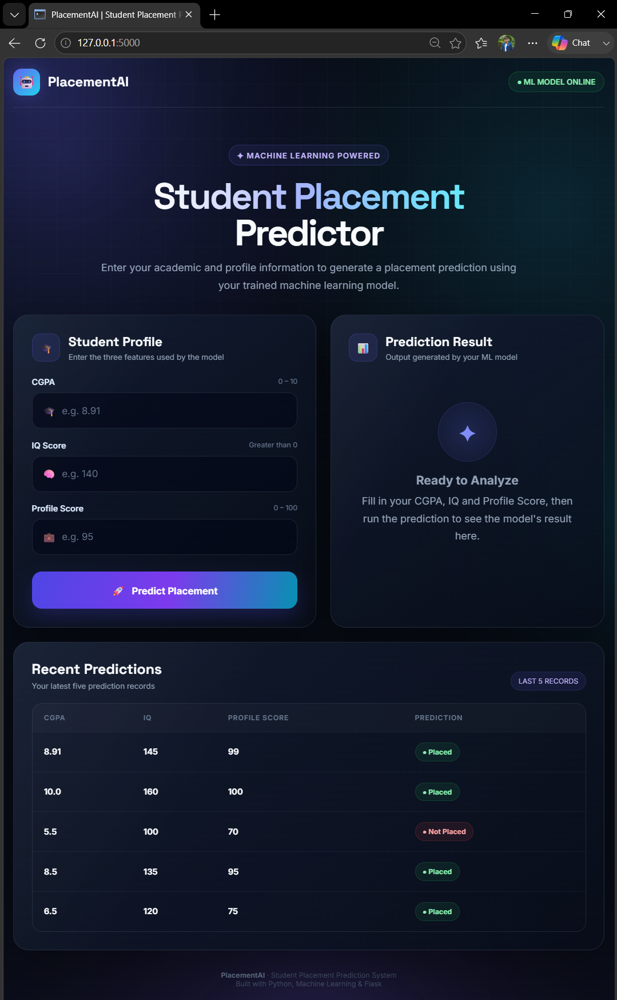
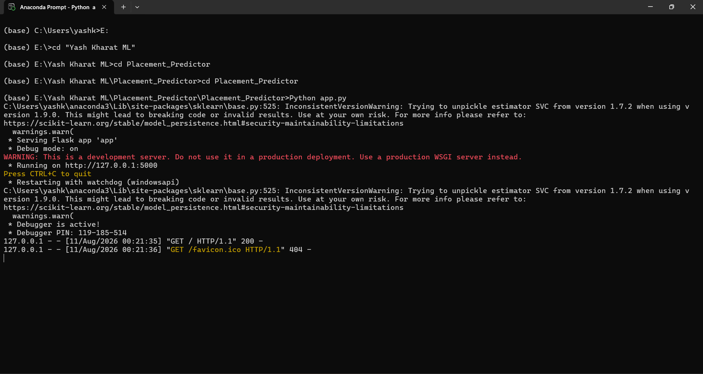

# 🤖 AI Student Placement Predictor

A Machine Learning-based web application that predicts a student's placement outcome using academic and profile-related information.

The **AI Student Placement Predictor** provides an interactive AI-themed dashboard where users can enter their **CGPA, IQ Score, and Profile Score** and receive a placement prediction from a trained Machine Learning model.

---

## 📸 Project Screenshots

### 🖥️ Placement Predictor Dashboard

<p align="center">
  
</p>

### 💻 Application Running in Anaconda Prompt

<p align="center">
  
</p>

---

## 🎯 Project Overview

The **AI Student Placement Predictor** demonstrates how Machine Learning can be integrated with a web-based application to make student placement predictions.

The user provides:

- 🎓 **CGPA**
- 🧠 **IQ Score**
- 💼 **Profile Score**

These inputs are passed to the trained Machine Learning model, which generates the placement prediction.

---

## ✨ Key Features

- 🤖 Machine Learning-based placement prediction
- 🎓 Student CGPA input
- 🧠 IQ Score input
- 💼 Profile Score input
- 📊 Interactive prediction dashboard
- 🕘 Recent prediction history
- 🌙 Modern dark AI-themed interface
- 🌐 Web-based application
- 💾 Pre-trained Machine Learning model
- 📱 Responsive user interface

---

## 🛠️ Technologies Used

| Technology | Purpose |
|---|---|
| 🐍 Python | Backend programming |
| 🤖 Scikit-learn | Machine Learning |
| 🔢 NumPy | Numerical operations |
| 🐼 Pandas | Data processing |
| 🌐 Flask | Web application |
| HTML | Web structure |
| CSS | UI design |
| JavaScript | Frontend interactions |
| Git & GitHub | Version control |

---

## 📊 Input Features

| Input | Description |
|---|---|
| 🎓 CGPA | Student's academic performance |
| 🧠 IQ Score | Student's IQ score |
| 💼 Profile Score | Overall profile score |

### Prediction Output

The model provides a placement classification:

```text
✅ Placed
❌ Not Placed
